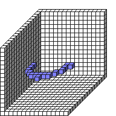

#ArcXZ

##Description: Draw 2D Arc <x> <y> <z> <radius> <startAngle> <sweepAngle>

Figure Code:
- [Genesis3D.md](Genesis3D) 16
- [WallCube.md](WallCube) 37
- [PenColorD4.md](PenColorD4) 127 127 255 255
- [ArcXZ.md](ArcXZ) 7 7 7 5 0 50

Condensed: Genesis3D 16;WallCube 37;PenColorD4 127 127 255 255;ArcXZ 7 7 7 5 0 50

