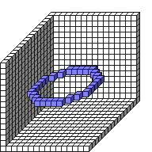

#Circle2DXZ

##Description: Draw 2D Circle on y-Axis <x> <y> <z> <radius>

Figure Code:
- [Genesis3D.md](Genesis3D) 16
- [WallCube.md](WallCube) 37
- [PenColorD4.md](PenColorD4) 127 127 255 255
- [Circle2DXZ.md](Circle2DXZ) 7 7 7 5

Condensed: Genesis3D 16;WallCube 37;PenColorD4 127 127 255 255;Circle2DXZ 7 7 7 5

