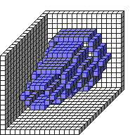

#ExtrudeZ

##Description: <x> <y> <z1> <z2> <Shape> <StartScale> <StopScale> <Skips>

Figure Code:
- [Genesis3D.md](Genesis3D) 16
- [WallCube.md](WallCube) 37
- [PenColorD4.md](PenColorD4) 127 127 255 255
- [ExtrudeZ.md](ExtrudeZ) 7 7 0 15 6 3 7 0

Condensed: Genesis3D 16;WallCube 37;PenColorD4 127 127 255 255;ExtrudeZ 7 7 0 15 6 3 7 0

