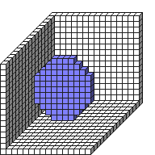

#FillCircle2DXY

##Description: Draw Filled 2D Circle on z-axis <x> <y> <z> <radius>

Figure Code:
- [Genesis3D.md](Genesis3D) 16
- [WallCube.md](WallCube) 37
- [PenColorD4.md](PenColorD4) 127 127 255 255
- [FillCircle2DXY.md](FillCircle2DXY) 7 7 7 5

Condensed: Genesis3D 16;WallCube 37;PenColorD4 127 127 255 255;FillCircle2DXY 7 7 7 5

