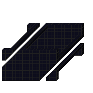

#FilterMotion

##Description: Motion filter

Figure Code:
- [Genesis3D.md](Genesis3D) 16
- [PenColorD4.md](PenColorD4) 127 127 255 255
- [Rect.md](Rect) 1 7 1 14 7 14
- [FilterMotion.md](FilterMotion)

Condensed: Genesis3D 16;PenColorD4 127 127 255 255;Rect 1 7 1 14 7 14;FilterMotion

