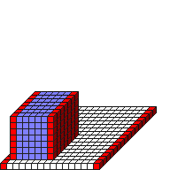

#ImgEdgeX

##Description: Set edge x color <r> <g> <b> <a>

Figure Code:
- [Genesis3D.md](Genesis3D) 16
- [WallCube.md](WallCube) 1
- [PenColorD4.md](PenColorD4) 127 127 255 255
- [FillRect.md](FillRect) 1 1 1 7 7 7
- [ImgEdgeX.md](ImgEdgeX) 255 0 0 255

Condensed: Genesis3D 16;WallCube 1;PenColorD4 127 127 255 255;FillRect 1 1 1 7 7 7;ImgEdgeX 255 0 0 255

