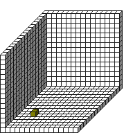

#PenColorD2

##Description: Set Pen rgba <v1> <v2>

Figure Code:
- [Genesis3D.md](Genesis3D) 16
- [WallCube.md](WallCube) 37
- [PenColorD2.md](PenColorD2) 127 127
- [Plot.md](Plot) 4 1 4

Condensed: Genesis3D 16;WallCube 37;PenColorD2 127 127;Plot 4 1 4

