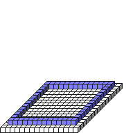

#Rect

##Description: Draw hollow 3D rectangle <x1> <y1> <z1> <x2> <y2> <z2>

Figure Code:
- [Genesis3D.md](Genesis3D) 16
- [WallCube.md](WallCube) 1
- [PenColorD4.md](PenColorD4) 127 127 255 255
- [Rect.md](Rect) 1 1 1 14 1 14

Condensed: Genesis3D 16;WallCube 1;PenColorD4 127 127 255 255;Rect 1 1 1 14 1 14

