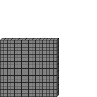

#Size2D1

##Description: Create 1-byte 2D grid of <width> <height>

Figure Code:
- [Size2D1.md](Size2D1) 16 16
- [PenColorD1.md](PenColorD1) 127
- [Clear.md](Clear)

Condensed: Size2D1 16 16;PenColorD1 127;Clear

