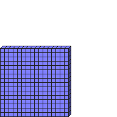

#Size2D3

##More: w h##Description: Create 3-byte 2D grid of <width> <height>

Figure Code:
- [Size2D3](Size2D3.md) 16 16
- [PenColorD3](PenColorD3.md) 127 127 255
- [Clear](Clear.md)

Condensed: Size2D3 16 16;PenColorD3 127 127 255;Clear

