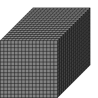

#Size3D1

##Description: Create 1-byte 3D grid of <width> <height> <depth>

Figure Code:
- [Size3D1.md](Size3D1) 16 16 16
- [PenColorD1.md](PenColorD1) 127
- [Clear.md](Clear)

Condensed: Size3D1 16 16 16;PenColorD1 127;Clear

