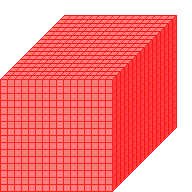

#Size3D2

##Description: Create 2-byte 3D grid of <width> <height> <depth>

Figure Code:
- [Size3D2.md](Size3D2) 16 16 16
- [PenColorD2.md](PenColorD2) 127 127
- [Clear.md](Clear)

Condensed: Size3D2 16 16 16;PenColorD2 127 127;Clear

