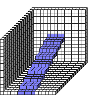

#Stairs

##Description: Create stairs <x1> <y1> <z1> <x2> <y2> <z2> <PenWidth> <PenHeight> <PenDepth>

Figure Code:
- [Genesis3D.md](Genesis3D) 16
- [WallCube.md](WallCube) 37
- [PenColorD4.md](PenColorD4) 127 127 255 255
- [Stairs.md](Stairs) 7 0 0 7 8 15 5 1 1

Condensed: Genesis3D 16;WallCube 37;PenColorD4 127 127 255 255;Stairs 7 0 0 7 8 15 5 1 1

